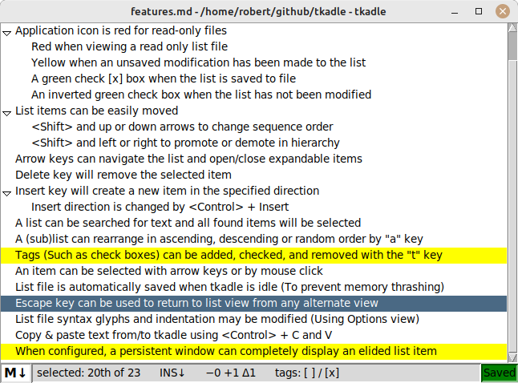

This directory contains the single file source code for running **tkadle**. Currently, this program can only run on Linux.

Installation
------------

Download "tkadle.tcl" to any location, then ensure the file permissions allow for execution.

Dependencies
------------

Installation and running of **tkadle** requires TCL (Version 8.6) and TK (Version 8.6). The installation of these packages is outside the scope of this README.

Installing for MacOS and Windows
--------------------------------

No plans exist for porting **tkadle** to MacOS or Windows.

Running
-------

**tkadle** is intended to be run from the command line where the file format is specified. For example, to edit a markdown formatted list named "todo.txt" the command would be:

> tkadle.tcl -syn markdown todo.txt
